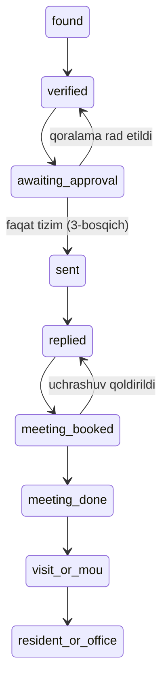

# Outreach CRM — amalga oshirish rejasi (1-bosqich)

Holati: 2026-09-27 · 2-tahrir (egasining javoblari kiritildi) · yakuniy tasdiq kutilmoqda. Tasdiqlanmaguncha migratsiya va kod yozilmaydi.

Asos: [SPEC.md](SPEC.md) (0, 3, 4.1, 5, 8-bo'limlar), [CLAUDE.md](CLAUDE.md). `country-analysis.md` hali qo'shilmagan — seed bo'limi shunga bog'liq.

## Qabul qilingan qarorlar

| Mavzu | Qaror |
| --- | --- |
| Kim ishlaydi | Viloyat hokimligi va tuman (shahar) hokimliklari maslahatchilari (`advisor_viloyat`, `advisor_tuman`) |
| Kim tasdiqlaydi | Faqat viloyat — bittalab va **ommaviy** tasdiqlash |
| "Hudud" | Lidning **davlati**. Xorazm tumani bo'yicha bo'linish yo'q |
| Lid manbasi | Claude har kuni avtomatik yig'ib MCP orqali yuklaydi + maslahatchilar qo'lda qo'shadi |
| MCP | Platforma ichida (8-bo'lim, (a)), internetdan ochiq, lekin kirish tor doirada — faqat egasi uchun (5-bo'lim) |

## 0. Kod bazasidan kelib chiqqan cheklovlar

| Mavzu | Holat | Rejaga ta'siri |
| --- | --- | --- |
| Stek | Laravel 13.20, PHP 8.4 (lokal `C:\php84\php.exe`, prod 8.5-fpm), PostgreSQL, Sanctum 4.3, PHPUnit 12 | Backend PHP'da yoziladi |
| Baza | Bitta baza, har domen — alohida schema va ulanish. `advisor` ulanishi `search_path = advisor,master,public` | Yangi jadvallar `advisor` schema'siga `outreach_` prefiksi bilan tushadi — yangi ulanish kerak emas |
| Konvensiya | uuid PK (`HasUuids`), `timestamps`, `auth.users`ga cross-schema FK yo'q (uuid + index), migratsiyalar faqat pgsql'da, idempotent, forward-only | Shu uslubga to'liq amal qilinadi |
| Advisor kodi | Policy, FormRequest, Resource, enum yo'q. Ruxsat — `AdvisorAccess` rol→ruxsat xaritasi, qamrov — `AdvisorScope` (faqat tuman bo'yicha) | Shu naqsh davom ettiriladi; egalik (owner) bo'yicha qamrov yangidan qo'shiladi |
| Rollar | `advisor_viloyat` (`*`), `advisor_bolinma`, `advisor_tuman`. Viloyat — hozir faqat `umdsoft` | Yangi ruxsat kodlari viloyatga avtomatik beriladi, qolganlarga aniq yoziladi |
| Audit | Advisor'da audit jadvali yo'q. Qurilish'da `AuditLogger` (append-only) naqshi bor | `outreach_audit_log` jadvali shu naqshda |
| Tokenlar | Sanctum `personal_access_tokens` (`public` schema). Abilities hech qayerda tekshirilmaydi | MCP tokenlari Sanctum'dan **alohida** saqlanadi (5-bo'lim) |
| Navbat | `QUEUE_CONNECTION=database`, advisor'da job yo'q | 1-bosqichda navbat kerak emas |
| Testlar | PHPUnit, dev bazada `DatabaseTransactions`, `RefreshDatabase` taqiqlangan. `AdvisorTestCase` `advisor` ulanishini qamraydi | Jadvallar `advisor`da bo'lgani uchun test infratuzilmasi o'zgarmaydi |
| Deploy | `migrate --force`, seed ishlatilmaydi | Davlatlar ro'yxati **ma'lumot migratsiyasi** orqali kiritiladi |
| Frontend | Vue 3 + Pinia + Tailwind v4, UI kutubxonasi yo'q, matn — o'zbek kirill, qo'lda yozilgan komponentlar | `Archive.vue`, `MonitoringDetail.vue`, `TaskDetailModal.vue`, `Dashboard.vue` naqshlari qayta ishlatiladi |
| MCP | Hech qanday MCP paketi yoki kodi yo'q | 8-bo'limda yondashuv tanlanadi |

## 1. Joylashuv

**Backend** (`D:\kadr\platform`), boshqa advisor kodiga aralashmasligi uchun alohida namespace:

```
app/Domains/Advisor/Outreach/
  Models/          Country, Company, Contact, Message, Reply, Meeting, Touch, AuditEntry, McpToken
  Services/        CompanyService, ContactService, StageMachine, IcpScorer, DedupeService,
                   ApprovalService, StatsService, AuditLogger, McpTokenService
  Http/Controllers/Api/   (UI uchun REST)
  Http/Middleware/AuthenticateMcpToken.php
  Mcp/             server + 8 ta tool
  Support/         Stage (konstantalar + o'tishlar), Tier, OutreachAccess yordamchisi
database/migrations/2026_09_2x_*_create_advisor_outreach_*.php
routes/api/outreach.php        (/api/advisor/outreach/..., auth:sanctum + advisor)
routes/mcp.php yoki shu fayl   (/mcp/outreach — alohida guard, 5-bo'lim)
tests/Feature/Advisor/Outreach/
```

**Frontend** (`D:\kadr\advisor`):

```
src/pages/outreach/  Leads.vue, CompanyDetail.vue, Approvals.vue, Stats.vue, McpToken.vue
src/stores/outreach.ts
src/lib/outreach.ts   (bosqich/toifa meta xaritalari — StatusBadge uchun)
src/types/index.ts    (yangi tiplar qo'shiladi)
```

## 2. Ma'lumotlar modeli

Barchasi `advisor` schema'sida. `*_user_id` — `auth.users.id` (FK yo'q, uuid + index).

### `outreach_countries`

| Ustun | Tur | Izoh |
| --- | --- | --- |
| `code` | char(2) PK | ISO 3166-1 alpha-2. Tabiiy kalit — uuid bu yerda foyda bermaydi |
| `name` | string | |
| `wave` | string(10) | `1` / `2` / `investor` |
| `score` | smallint null | country-analysis bali |
| `excluded` | bool | `true` bo'lsa, kompaniya qo'shish rad etiladi |
| `excluded_reason` | text null | |
| `default_language` | string(5) null | xat tili (ru/tr/zh/en…) |

### `outreach_companies`

| Ustun | Izoh |
| --- | --- |
| `id` uuid PK | |
| `name`, `domain` (**unique**, normallashtirilgan) | domen: kichik harf, `www.`/sxema/yo'l olib tashlanadi |
| `country_code` → `outreach_countries.code` | FK (bir schema ichida) |
| `region_city` | kompaniya shtab-kvartirasi shahri (xorijda, ma'lumot uchun) |
| `owner_user_id` | lid egasi — maslahatchi (`auth.users.id`). Claude qo'shgan lidda — MCP token egasi. Viloyat UI'da egasini almashtira oladi (lidni tumanga berish) |
| `employees`, `industry`, `has_offshore_center`, `open_roles_6m`, `client_regions` (jsonb), `languages` (jsonb), `source` | ICP kirish ma'lumotlari |
| `export_contract_usd` null, `parent_revenue_usd` null | Zero Risk mezoni uchun (ixtiyoriy) |
| `icp_score` smallint, `tier` char(1) A/B/C | server hisoblaydi, qo'lda yozilmaydi |
| `sanctions_status` | `clear` / `hit` / `unchecked` (standart `unchecked`) |
| `stage` | 3-bo'limdagi holatlar |
| `stage_changed_at`, `created_by`, `timestamps` | |

### `outreach_contacts`

`id`, `company_id` (FK), `full_name`, `title`, `role_type` (ceo/coo/cto/delivery/expansion), `email` (**unique**, kichik harf), `email_status` (verified/catch_all/invalid/unknown), `verified_at`, `linkedin_url`, `language`, `unsubscribed_at`, `do_not_contact` (bool), `created_by`, `timestamps`.

"Faol kontakt" = `do_not_contact = false` va `unsubscribed_at IS NULL` va `email_status <> 'invalid'`.

### `outreach_messages` (tasdiqlash navbati shunga tayanadi)

`id`, `contact_id` (FK), `sequence_step` (1/2/3), `language`, `subject`, `body`, `body_hash` (sha256), `status` (draft/approved/sent/bounced/replied/cancelled/rejected), `approved_by_user_id`, `approved_at`, `rejected_by_user_id`, `rejected_at`, `reject_reason`, `scheduled_for`, `sent_at`, `smtp_message_id`, `created_by`, `timestamps`.

SPEC'dagi statuslarga `rejected` qo'shildi — UI'dagi "rad etish" uchun.

### `outreach_replies`, `outreach_meetings`

SPEC 3-bo'limidagi maydonlar bilan, hozir faqat yaratiladi (3–4-bosqichlarda to'ldiriladi).

### `outreach_touches` (yangi — SPEC'da jadval yo'q, lekin `log_touch` va "aloqalar tarixi" uchun kerak)

`id`, `company_id`, `contact_id` null, `channel` (email/linkedin/call/meeting/other), `direction` (out/in), `summary`, `occurred_at`, `actor_user_id`, `via` (ui/mcp), `created_at`.

### `outreach_audit_log` (append-only)

`id`, `actor` (user/claude/system), `actor_user_id`, `via` (ui/mcp/system), `mcp_token_id` null, `action`, `entity`, `entity_id`, `payload_json` (jsonb), `ip`, `created_at`. Faqat `created_at` (updated_at yo'q).

PostgreSQL trigger `UPDATE` va `DELETE`ni taqiqlaydi — audit yozuvini ilova kodi ham o'zgartira olmaydi.

### `outreach_mcp_tokens`

`id`, `user_id`, `name`, `token_hash` (sha256, unique), `last_used_at`, `expires_at`, `revoked_at`, `created_at`. Ochiq token faqat yaratilgan paytda bir marta ko'rsatiladi.

## 3. Holatlar mashinasi



Yopiq holatlarga o'tish:

- `closed_unsubscribed` — istalgan ochiq holatdan (obunadan chiqish darhol bajariladi).
- `blocked_sanctions` — istalgan holatdan (`sanctions_status = hit` bo'lganda avtomatik).
- `closed_declined` — `sent`, `replied`, `meeting_booked`, `meeting_done`, `visit_or_mou`dan.

Kim o'tkaza oladi:

| O'tish | MCP (`set_stage`) | UI | Tizim |
| --- | --- | --- | --- |
| found → verified | ha (kamida 1 ta `verified` emailli faol kontakt bo'lsa) | ha | — |
| verified → awaiting_approval | ha (kamida 1 ta `draft` xabar bo'lsa) | ha | — |
| → sent | **yo'q** | **yo'q** | faqat `send_approved` (3-bosqich) |
| sent → replied, replied → meeting_booked | ha | ha | javob/kalendar (3–4-bosqich) |
| → meeting_done, visit_or_mou, resident_or_office | **yo'q** (SPEC 5 — inson qarori) | ha | — |
| → closed_* | ha (`closed_declined`, `closed_unsubscribed`) | ha | ha |
| yopiq holatdan qaytish | yo'q | 7-savolga qarang | — |

Qoidalar `Support/Stage` klassida bitta joyda yoziladi. Controller ham, MCP ham faqat `StageMachine` orqali o'tadi. Ruxsatsiz o'tish 422 va audit yozuvi bilan rad etiladi.

## 4. Ruxsatlar

Yangi ruxsat kodlari (`AdvisorAccess::PERMISSIONS`ga qo'shiladi):

| Kod | Ma'nosi |
| --- | --- |
| `outreach.view` | lidlar ro'yxati, karta, statistika |
| `outreach.manage` | kompaniya/kontakt qo'shish, tahrirlash, bosqich o'zgartirish, touch yozish |
| `outreach.approve` | xat seriyasini tasdiqlash yoki rad etish (**faqat UI**) |
| `outreach.mcp` | o'z MCP tokenini yaratish va bekor qilish |

Tanlangan taqsimot:

| Rol | view | manage | approve | mcp | Qamrov |
| --- | --- | --- | --- | --- | --- |
| `advisor_viloyat` | ha | ha | ha (bittalab + ommaviy) | ha | barcha lidlar |
| `advisor_tuman` | ha | ha | yo'q | yo'q | faqat o'z lidlari (`owner_user_id = o'zi`) |
| `advisor_bolinma` | yo'q | yo'q | yo'q | yo'q | — (hozir outreach'da ishtirok etmaydi; kerak bo'lsa keyin qo'shiladi) |

- Viloyat `*` orqali hammasini avtomatik oladi, tumanga `outreach.view` va `outreach.manage` aniq yoziladi.
- Tuman boshqa maslahatchining lidini ko'rmaydi (404). Dublikat tekshiruvida faqat "bu kompaniya allaqachon bor" deyiladi.
- MCP token faqat viloyatda bo'ladi — tizimga Claude orqali kirish faqat egasining qo'lida.

## 5. MCP tokenlari va xavfsizlik

- **Sanctum'dan alohida.** Tokenlar `outreach_mcp_tokens` jadvalida saqlanadi va faqat `/mcp/outreach` route'ida qabul qilinadi. Sabab: platformada Sanctum abilities tekshirilmaydi. Oddiy Sanctum token bo'lsa, u butun advisor API'sida to'liq huquq bilan ishlab ketadi. Alohida token esa boshqa hech bir route'da ishlamaydi — minimal huquq qurilishning o'zida kafolatlanadi. Mavjud modullarga tegilmaydi.
- **Token egasining huquqi bilan ishlaydi.** Har chaqiruvda token → user → `AdvisorAccess` ruxsati va qamrovi tekshiriladi. Token egasida `outreach.manage` bo'lmasa, yozish tool'lari ishlamaydi.
- **Saqlash va umr.** Faqat sha256 hash saqlanadi. Bir maslahatchida bitta faol token. Standart muddat 90 kun, UI'dan bekor qilinadi.
- **Tool cheklovlari.** O'chirish tool'i yo'q. Tasdiqlash tool'i yo'q — `approve` faqat UI controller'ida, MCP kodida umuman chaqirilmaydi.
- **Audit.** Har bir yozish amali `outreach_audit_log`ga `actor=claude`, `via=mcp`, `mcp_token_id` bilan yoziladi.
- **Kiruvchi ma'lumot.** MCP'dan kelgan matn (kompaniya tavsifi, summary) faqat ma'lumot sifatida saqlanadi va UI'da escape qilinadi.

### Internetga ochiq endpoint uchun himoya qavatlari

Endpoint internetdan ochiq, chunki Claude har kuni avtomatik ishlaydi va qayerdan ishga tushishi oldindan ma'lum emas (IP ro'yxati bilan cheklab bo'lmaydi). Kirish imkoni shunday toraytiriladi:

| # | Qavat | Nimani to'xtatadi |
| --- | --- | --- |
| 1 | **Cloudflare Access service token** — `/mcp/outreach` oldida. So'rovda `CF-Access-Client-Id` va `CF-Access-Client-Secret` bo'lmasa, Cloudflare uni origin'ga yetkazmaydi | Tashqi skanerlar serverga umuman yetib kelmaydi |
| 2 | **Platforma tokeni** (256 bit, faqat hash saqlanadi, 90 kun, bekor qilinadi) | Cloudflare kaliti sizib chiqsa ham tizimga kira olmaydi |
| 3 | **Token faqat viloyatda** va faqat MCP route'ida ishlaydi | Token sizib chiqsa, boshqa API'ga kira olmaydi |
| 4 | **Rate limit**: 120 chaqiruv/daqiqa, yozish 60/daqiqa, **kunlik yozish chegarasi 3 000** | Sizib chiqqan token bilan bazani to'ldirib yuborib bo'lmaydi |
| 5 | **Imkoniyat chegarasi**: o'chirish va tasdiqlash tool'lari yo'q, `→ sent` va inson bosqichlari MCP'dan yopiq | Eng yomon holatda ham xat ketmaydi va ma'lumot o'chmaydi |
| 6 | **Audit + SOC ogohlantirish**: har yozish auditga tushadi. Kunlik chegaraga yaqinlashish yoki noma'lum IP'dan chaqiruv mavjud `soc-alerter` orqali emailga keladi | Suiiste'mol darhol ko'rinadi |

Kunlik chegara avtomatik yig'ish uchun mo'ljallangan: taxminan 300 kompaniya + 600 kontakt + tekshiruvlar. Kerak bo'lsa `.env`da o'zgartiriladi.

1-qavat Cloudflare panelida sozlanadi (Zero Trust → Access → Service Auth). Sozlash yo'riqnomasini README'ga yozaman, uni siz yoki men sizning ruxsatingiz bilan qo'shamiz.

**Topilgan alohida xavf (hozir tuzatilmaydi):** hozirgi advisor route'lari istalgan Sanctum tokenni qabul qiladi. Mahalla mobil tokeni (muddatsiz) advisor'ga ham to'liq kiradi. Bu mavjud modul, shuning uchun ruxsatingizsiz o'zgartirmayman — alohida vazifa sifatida taklif qilaman.

## 6. Biznes qoidalari (servislar)

- **`IcpScorer`** — 100 ballik jadval (SPEC 4.2). SPEC har band uchun faqat diapazon beradi, shuning uchun aniq qoida taklif qilaman (5-savol):

  | Belgi | Qoida |
  | --- | --- |
  | Xodimlar | 50–2 000 → 15; 30–49 yoki 2 001–5 000 → 7; boshqa → 0 |
  | Offshore/nearshore markaz | bor → 15 |
  | Ochiq vakansiya (6 oy) | ≥ 20 → 15; 5–19 → 8; 1–4 → 3 |
  | Mijozlar AQSh/YeI'da | biri bor → 10 |
  | Soha | outsourcing, BPO/KPO, logistika dispetcherlik, agro-IT, gamedev → 15; umumiy dasturiy ta'minot → 5 |
  | Til (rus, turk, ingliz) | kamida bittasi → 10 |
  | Qaror qiluvchining emaili | `verified` → 20; `catch_all` → 10 |
  | Sanksiya `hit` | ball hisoblanmaydi, `blocked_sanctions` |

  Toifa: A ≥ 70, B 50–69, C < 50. Ball har `upsert_company`/`upsert_contact`da qayta hisoblanadi, qo'lda yozib bo'lmaydi.
- **`DedupeService`** — domen va email normallashtiriladi, bazada `unique` indeks bor. `dedupe_check` boshqa maslahatchining lidini topsa, faqat "mavjud, egasi: F.I.Sh." deydi va tafsilotini bermaydi.
- **Chiqarilgan davlat.** `country.excluded = true` bo'lsa, `upsert_company` 422 va sabab (`excluded_reason`) bilan rad etadi. Davlat jadvalda bo'lmasa ham rad etadi.
- **Kontaktlar limiti.** Kompaniya qatori `SELECT … FOR UPDATE` bilan qulflanadi, faol kontaktlar sanaladi. 2 ta bo'lsa, uchinchisi rad etiladi (poyga holatidan himoya).
- **`ApprovalService`** — faqat UI chaqiradi:
  - tasdiqlash: `body_hash = sha256(subject + "\n" + body)`, `approved_by_user_id`, `approved_at` yoziladi;
  - rad etish: sabab majburiy;
  - tasdiqlangan xat tahrirlansa, `approved`dan `draft`ga qaytadi va tasdiq tozalanadi;
  - tasdiqlash oldidan tekshiriladi: kompaniya `blocked_sanctions` emas, toifa A yoki B, kontakt `do_not_contact` emas va obunadan chiqmagan, davlat chiqarilmagan;
  - **ommaviy tasdiqlash**: tanlangan xabarlar bitta so'rovda. Har biri yuqoridagi shartlar bilan alohida tekshiriladi, o'z hash'i va audit yozuvini oladi. Shartdan o'tmaganlari tasdiqlanmaydi va javobda sababi bilan qaytariladi (qolganlari baribir tasdiqlanadi). Bir so'rovda ko'pi bilan 200 ta;
  - ommaviy rad etish ham bor — bitta umumiy sabab bilan.

## 7. UI sahifalari (advisor SPA)

| Sahifa | Route | Naqsh | Mazmuni |
| --- | --- | --- | --- |
| Lidlar | `/outreach` | `Archive.vue` | filtrlar: davlat, to'lqin (1/2/investor), bosqich, toifa A/B/C, egasi (faqat viloyatga), manba (Claude/qo'lda); server tomonida sahifalash; bosqich va toifa — `StatusBadge` |
| Kompaniya kartasi | `/outreach/companies/:id` | `MonitoringDetail.vue` | rekvizitlar, ICP ball tarkibi, kontaktlar (≤ 2 faol), aloqalar tarixi (`ActivityTimeline`), bosqich o'zgartirish (faqat ruxsat etilgan o'tishlar), egasini almashtirish (faqat viloyat) |
| Tasdiqlash navbati | `/outreach/approvals` | `TaskDetailModal.vue` | faqat viloyat. Kontakt bo'yicha seriya (1–3 xat): ko'rish, tahrirlash, tasdiqlash, sababi bilan rad etish. **Ommaviy**: belgilash katakchalari, "Tanlanganlarni tasdiqlash" / "rad etish", davlat va toifa bo'yicha filtr. Natija: nechtasi tasdiqlandi, qaysilari nima sababdan o'tmadi |
| Statistika | `/outreach/stats` | `Dashboard.vue` | davlat kesimida 6 ko'rsatkich: yuborilgan, yetib borgan, javob ulushi, qiziqqan, o'tgan uchrashuv, rezident (`BarChart`, jadval). Viloyatga qo'shimcha: maslahatchilar kesimi |
| MCP token | `/outreach/token` | — | faqat viloyat: token yaratish (bir marta ko'rsatiladi), muddati, oxirgi ishlatilgan vaqt va IP, bekor qilish, ulanish namunasi |

Sidebar'ga "Ҳорижий инвесторлар" bo'limi qo'shiladi (`meta.roles` 4-bo'limdagi tanlovga ko'ra).

1-bosqichda xat yuborilmaydi, shuning uchun statistika nollarni ko'rsatadi. Tasdiqlash navbati esa faqat testlardagi qoralamalar bilan tekshiriladi — `create_draft` 3-bosqichda keladi.

## 8. MCP yondashuvi: platforma ichida yoki alohida

| Mezon | (a) Platforma ichida (Streamable HTTP endpoint) | (b) Alohida MCP server (TypeScript) → platforma API |
| --- | --- | --- |
| Qoidalar qayerda | bitta joyda — mavjud servislar (StageMachine, IcpScorer) | baribir platforma API'sida bo'lishi shart ("server kodida") + MCP qatlami |
| Hujum yuzasi | bitta endpoint, bitta token turi | platforma API tokeni + MCP server + ular orasidagi kanal |
| Audit, rate limit | bitta tranzaksiya ichida | ikki joyda |
| Kod bazasi | bitta (PHP) | ikkita (PHP + TS), ikki deploy |
| SDK | `laravel/mcp` (Laravel 13 bilan mosligi tekshiriladi; mos kelmasa — 8 ta tool uchun JSON-RPC endpoint qo'lda) | rasmiy TS SDK (SPEC tavsiyasi) |
| Claude Code / Desktop'ga ulanish | HTTP MCP to'g'ridan-to'g'ri (Desktop'da kerak bo'lsa `mcp-remote` ko'prigi) | `stdio` — lokal jarayon |

**Qaror: (a).** Xavfsizlik baribir platforma serverida ta'minlanishi kerak. (b) buni o'zgartirmaydi, faqat internetga qaragan ikkinchi eshik, ikkinchi kod bazasi va ikkinchi token qo'shadi. (a)da tasdiqlash tool'ining yo'qligi, audit va rate limit bitta kodda tekshiriladi. Endpoint 5-bo'limdagi olti qavat bilan himoyalanadi.

Til — PHP (platforma bilan bir xil). SPEC TypeScript'ni tavsiya qilgan edi, lekin (a) tanlanganda alohida TS server kerak emas.

## 9. Seed ma'lumot

Deploy'da seed ishlamaydi, shuning uchun davlatlar **ma'lumot migratsiyasi** (`updateOrInsert`, idempotent) orqali kiritiladi:

- 13 ta nishon davlat (to'lqin va bali bilan);
- 6 ta chiqarilgan davlat (`excluded = true`, sababi bilan);
- Saudiya Arabistoni (`wave = investor`).

**Kutilmoqda:** `country-analysis.md` kelmaguncha ro'yxat to'ldirilmaydi — davlatlarni taxmin qilmayman.

## 10. Mavjud kodga tegadigan joylar (minimal)

| Fayl | O'zgarish |
| --- | --- |
| `app/Domains/Advisor/Support/AdvisorAccess.php` | 4-bo'limdagi ruxsat kodlari |
| `routes/api.php` | `routes/api/outreach.php` va MCP route'ini ulash |
| `app/Providers/AppServiceProvider.php` | `outreach-mcp` rate limiter |
| `bootstrap/app.php` | MCP token middleware alias'i |
| `composer.json` | `laravel/mcp` (agar (a) tanlansa va mos kelsa) |
| advisor: `router/index.ts`, `layouts/AppLayout.vue`, `components/Icon.vue` | route'lar, menyu, kerak bo'lsa ikonka |
| server: `/usr/local/bin/soc-alerter.py` (repo'dan tashqarida, `D:\kadr\monitor`) | MCP ogohlantirishlari (5-bo'lim, 6-qavat). Oxirgi qadam, deploy bilan birga — alohida ruxsat bilan |

Boshqa mavjud fayllar o'zgarmaydi.

## 11. Testlar

`tests/Feature/Advisor/Outreach/`, `AdvisorTestCase` asosida (`DatabaseTransactions`):

1. `StageTransitionTest` — har bir ruxsat etilgan va taqiqlangan o'tish, jumladan `→ sent`, MCP orqali `meeting_done`; yopiq holatlar.
2. `OwnershipAccessTest` — boshqa maslahatchining lidini ko'rish va tahrirlash (4-bo'limdagi tanlovga ko'ra 403/404), ruxsatsiz rol.
3. `ExcludedCountryTest` — chiqarilgan va noma'lum davlat rad etiladi (UI va MCP).
4. `DedupeTest` — domen normalizatsiyasi (`www`, katta harf, sxema), email dublikati, boshqa egadagi lid.
5. `ContactLimitTest` — 3-faol kontakt rad etiladi; obunadan chiqqan/invalid kontakt limitga kirmaydi.
6. `IcpScorerTest` — har bir band chegaralari, toifa chegaralari (49/50, 69/70), sanksiya.
7. `McpCannotApproveTest` — MCP tool'lar ro'yxatida `approve` yo'q; MCP token bilan tasdiqlash endpoint'i 401/403.
8. `AuditLogTest` — har bir yozish amali yozuv qoldiradi (UI va MCP); audit yozuvini `UPDATE`/`DELETE` qilib bo'lmaydi.
9. `McpTokenTest` — token faqat MCP route'ida ishlaydi (advisor API'da 401), muddati o'tgan va bekor qilingan token, rate limit.
10. `ApprovalTest` — tasdiqlashda hash yoziladi, tahrirlash tasdiqni bekor qiladi, rad etish sababsiz bo'lmaydi, tuman tasdiqlay olmaydi.
11. `BulkApprovalTest` — aralash to'plam: shartga mos kelganlari tasdiqlanadi, qolganlari sababi bilan qaytadi; 200 dan ortiq so'rov rad etiladi; har biriga alohida audit yozuvi.
12. `OwnerReassignTest` — faqat viloyat egasini almashtiradi; yangi egasi (tuman) lidni ko'radi, oldingisi ko'rmaydi.
13. `McpDailyCapTest` — kunlik yozish chegarasidan keyin yozish tool'lari 429 qaytaradi, o'qish ishlashda davom etadi.

Qo'lda: MCP Inspector bilan 8 ta tool, natijalari hisobotda.

## 12. Commit rejasi

1. `feat(outreach): add schema migrations and models`
2. `feat(outreach): add stage machine, ICP scorer, dedupe and contact limit`
3. `feat(outreach): add audit log with append-only guard`
4. `feat(outreach): add REST API and permissions for advisor UI`
5. `feat(outreach): add scoped MCP tokens and MCP server with 8 tools`
6. `feat(advisor-ui): add outreach leads, company, approvals, stats pages`
7. `docs(outreach): add README with token and MCP client setup`

Har commitdan oldin shu bosqich testlari o'tishi kerak. Push, merge, prod baza va deploy — faqat ruxsat bilan.

## 13. Savollar (hozir kerak bo'lganlari)

Javob berilganlari (ruxsatlar, tasdiqlash, hudud, MCP joyi va ochiqligi) yuqoridagi "Qabul qilingan qarorlar"ga kiritildi. Qolganlari:

1. **Cloudflare Access (5-bo'lim, 1-qavat):** qo'shamizmi? U Cloudflare panelida sozlanadi. Rozi bo'lsangiz, yo'riqnoma yozaman va siz sozlaysiz (yoki menga ruxsat berasiz).
2. **ICP qoidalari:** 6-bo'limdagi jadval ma'qulmi?
3. **Yopiq lidni qayta ochish:** `closed_declined`ni viloyat UI'dan qayta ocha olsinmi (masalan, "keyinroq" degan kompaniya)?
4. **UI tili:** yangi sahifalar ham mavjud UI kabi kirill yozuvida bo'lsinmi?
