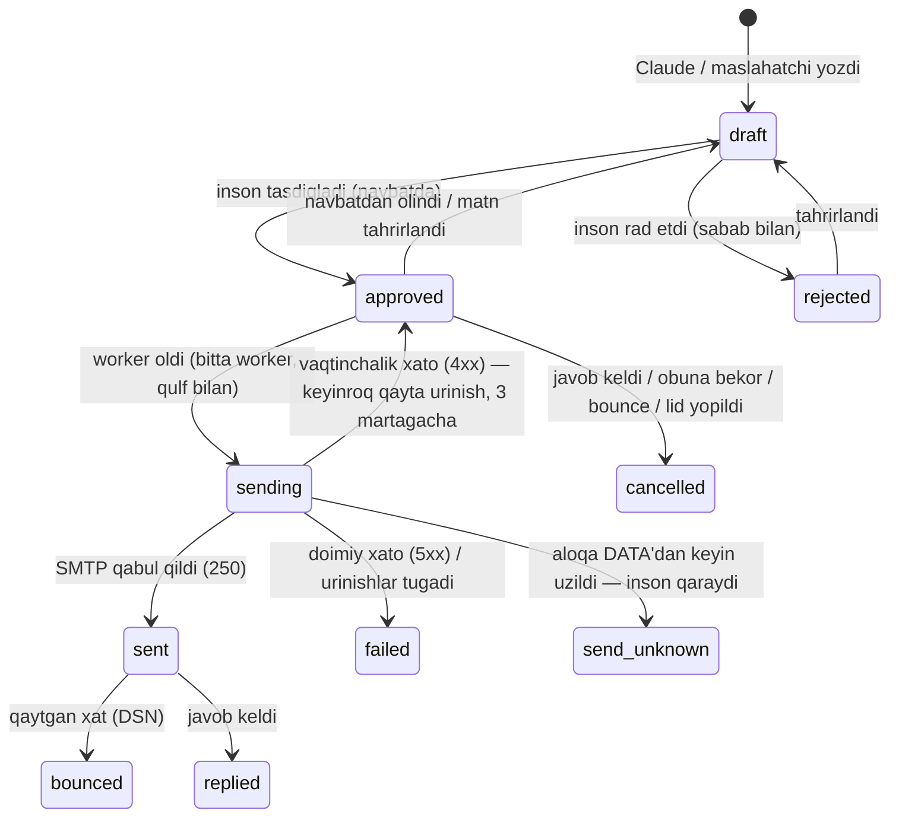

# Tasdiqlangan xatlarni avtomatik yuborish — loyiha (3-bosqich)

Holat: **loyiha; egasining qarorlari qabul qilindi (2026-09-27, §11).** Kod yozilmagan.
Bog'liq hujjatlar: [SPEC.md](SPEC.md) §4.3, §5, §6, §7 · [CLAUDE.md](CLAUDE.md) qoidalari 1, 5, 7, 8 · [PLAN-crm.md](PLAN-crm.md).

## 1. G'oya

Maslahatchi xatni (yoki xatlarni ommaviy) **tasdiqlaydi** — shundan keyin tizim ularni o'zi, navbat bilan,
belgilangan tezlikda yuboradi. Yuborish oddiy dastur kodi (Laravel queue + SMTP): **AI ishtirok etmaydi**.
AI (Claude, MCP orqali) faqat oldinroq qoralama tayyorlaydi.

```
Claude (MCP)             Inson (UI, viloyat)            Tizim (kod, AI yo'q)
─────────────            ───────────────────            ────────────────────
qoralama tayyorlaydi ──▶ o'qiydi, tahrirlaydi, ──▶ navbatga qo'yadi ──▶ vaqti kelganda
                         TASDIQLAYDI                     tekshiradi ──▶ SMTP ──▶ kompaniya
                                                          │
                                                          └─▶ bounce / javob / obunadan chiqish
                                                              ──▶ qolgan xatlar bekor
```

**SPEC'dan ongli farq:** SPEC §4.3'da `send_approved` MCP tool sifatida yozilgan. Bu loyihada yuborish
**MCP'da umuman yo'q** — uni faqat server ichidagi ishchi jarayon (worker) bajaradi. Claude xat yubora
olmaydi, hatto tasdiqlangan xatni ham. Bu SPEC'dagidan xavfsizroq: yuborish uchun hech qanday tashqi
kirish nuqtasi yo'q.

## 1a. Maqsadli hajm va iqtisod (egasi, 2026-09-27)

Qo'lda ishlagan davr natijasi: 10 kishi × ~100 xat = **~1000 xat/kun, 30 000+/oy**; javob ~1% (≈300/oy),
kuniga 2–3 uchrashuv; 3 oyda 3 ta yirik kompaniya, **$1 mln+ IT eksport**. Maqsad — shu hajmni
kam inson resursi va kam xarajat bilan avtomatlashtirish.

Oqibatlari loyiha uchun:

- **Bitta quti bilan 1000/kun mumkin emas.** Bir pochta qutisi sovuq xat uchun xavfsiz ~30–50/kun.
  Shuning uchun **jo'natuvchi qutilar pulli (sender pool)**: har bir quti o'z kunlik limiti va qizdirish
  jadvali bilan; tizim navbatni qutilar orasida taqsimlaydi. ~20–25 quti ≈ 1000/kun.
  Hammasi bitta mas'ul shaxs nomidan (qaror 4), manzillar turlicha bo'lishi mumkin.
- **Domenlar:** qutilarni 2–4 ta yordamchi domen/subdomenga bo'lish (bir domen shikoyat olsa,
  qolganlari ishlaydi). Asosiy `digital-xorazm.uz` hech qachon ishlatilmaydi.
- **Xarajat:** o'z relay/Mailcow'da qutilar bepul — faqat IP/PTR va domenlar (yiliga ~$10–15/domen).
  Workspace variantida ~$6 × 25 quti ≈ $150/oy. Kod ikkala holatda bir xil.
- **Tasdiqlash hajmi:** kuniga ~1000 xatni bittalab o'qib bo'lmaydi → ommaviy tasdiq (≤200/so'rov),
  seriya birga tasdiqlanadi; sifatni namunaviy tekshirish (random 10%) UI'da ko'rsatiladi (keyingi qadam).
- **Qizdirish:** har bir quti 3–4 haftada 10 → 40/kun. To'liq hajmga ~1 oyda chiqiladi; bu vaqt
  ichida qo'lda yuborish parallel davom etishi mumkin.

## 2. "Tasdiqlash = darhol yuborish" emas, "tasdiqlash = navbatga qo'yish"

Tasdiqlash tugmasi bosilganda xat darhol yuborilmaydi. Uch sabab:

1. **Kunlik limit va qizdirish.** Yangi subdomen kuniga 10–20 xat bilan boshlaydi (SPEC §6). 200 ta
   xatni birdan tasdiqlasangiz, ular bir necha kunga taqsimlanadi.
2. **Oluvchining ish vaqti.** Xat oluvchining mahalliy vaqti bilan ish kunida, 09:00–16:00 oralig'ida
   keladi (masalan, Germaniyaga — Berlin vaqti bilan).
3. **Tabiiy oraliq.** Xatlar orasida tasodifiy 3–7 daqiqa. Bir daqiqada 50 ta xat spam filtrlari uchun
   aniq signal.

Tasdiqlash oynasida ko'rsatiladi: *"3 ta xat navbatga qo'yiladi. Taxminiy yuborish: bugun 2 ta, ertaga 1 ta."*

**Yuborilgunga qadar tasdiqni qaytarib olish mumkin** ("Navbatdan olish" → xat `draft`ga qaytadi).

## 3. Xat holatlari



Yangi holatlar: `sending`, `failed`, `send_unknown`. **`send_unknown` hech qachon avtomatik qayta
yuborilmaydi**: xat yetib borganmi yoki yo'qmi, noma'lum. Ikki marta yuborishdan ko'ra inson qarori xavfsizroq.

## 4. Yuborishdan oldingi tekshiruv (SendGuard)

Worker har bir xatni **yuborish paytida** qayta tekshiradi. Tasdiqlash paytidagi tekshiruv yetarli emas:
o'tgan vaqt ichida kontakt obunadan chiqqan yoki sanksiya belgisi qo'yilgan bo'lishi mumkin.

| # | Shart | Buzilsa |
|---|---|---|
| 1 | `status = approved`, `approved_by` bor | yuborilmaydi |
| 2 | joriy `sha256(subject+"\n"+body)` = tasdiqlangandagi hash | `draft`ga qaytadi |
| 3 | kontakt faol: `do_not_contact` emas, obunadan chiqmagan, email `invalid` emas | `cancelled` |
| 4 | email/domen **supressiya ro'yxatida** emas (§7) | `cancelled` |
| 5 | kompaniya: sanksiya holati mos (§11, 2-savol), lid yopiq emas, toifa A/B | `cancelled` |
| 6 | davlat istisno qilinmagan | `cancelled` |
| 7 | kunlik limit, oluvchi domeniga kunlik limit (2 ta), yuborish oynasi | keyinroqqa suriladi |
| 8 | global **pauza** o'chiq, avtomatik to'xtatgich (circuit breaker) ochiq emas | kutadi |
| 9 | seriya: oldingi qadam `sent` va javob kelmagan | kutadi / `cancelled` |

Har bir rad etish sababi `outreach_send_log`ga va audit jurnaliga (`actor=system`) yoziladi.
SPEC §7'dagi 5 ta rad etish holatining har biri test bilan qoplanadi.

## 5. Ikki marta yubormaslik (idempotentlik)

- Worker xatni **atomar** oladi: `UPDATE ... SET status='sending', claim_id=:uuid WHERE id=:id AND status='approved'`.
  Ikkita worker bir xatni ololmaydi.
- `Message-ID` (masalan, `<uuid@invest.digital-xorazm.uz>`) yuborishdan **oldin** yaratilib saqlanadi.
  Javob va bounce'lar shu ID orqali xatga bog'lanadi.
- Qayta urinish faqat server xatni qabul qilmagani aniq bo'lganda (ulanish/4xx, DATA'gacha).

## 6. Xat seriyasi (0-, 4-, 10-kun)

- Maslahatchi **seriyani birgalikda** tasdiqlaydi: 1-xat va eslatma xatlari (2- va 3-xat) bir oynada
  ko'rinadi (SPEC §5.1 "xat seriyasini tasdiqlash").
- 2-xat 1-xat **haqiqatan yuborilgan** vaqtdan 4 kun keyin, 3-xat 10 kun keyin navbatga tushadi.
- Javob, obunadan chiqish, bounce yoki lid yopilishi → seriyaning qolgan xatlari avtomatik `cancelled`.
- Eslatma xatlari `In-Reply-To` bilan birinchi xatning davomi bo'lib boradi (bir yozishma).

## 7. Obunadan chiqish, bounce va javoblar

**Har bir xatda (SPEC §4.3):**
- `List-Unsubscribe: <https://…/u/{token}>, <mailto:unsubscribe+{token}@invest…>` va
  `List-Unsubscribe-Post: List-Unsubscribe=One-Click` (RFC 8058);
- xat oxirida obunadan chiqish havolasi;
- jo'natuvchining haqiqiy ismi, lavozimi, hokimlik nomi va manzili.

**Obunadan chiqish sahifasi** — ochiq (login'siz) endpoint, imzolangan token bilan:
- `POST` (bir bosishda, pochta mijozlari uchun) darhol bajaradi;
- `GET` tasdiqlash sahifasini ko'rsatadi (havola skanerlari tasodifan obunadan chiqarib yubormasligi uchun);
- natija: kontakt `unsubscribed`, email **supressiya ro'yxatiga**, lid `closed_unsubscribed`, navbatdagi xatlar `cancelled`.

**Supressiya ro'yxati** (`outreach_suppressions`): obunadan chiqqan, qattiq bounce bo'lgan yoki shikoyat
qilgan email'lar (va kerak bo'lsa butun domen). Kontakt o'chirilib, qayta qo'shilsa ham u yerga xat ketmaydi.

**Bounce va javoblar** — IMAP'dan davriy o'qish (har 5 daqiqada), AI'siz:
- DSN (qaytgan xat) → xat `bounced`, kontakt `invalid`, email supressiyaga (qattiq bounce), seriya bekor;
- `In-Reply-To`/`References` bo'yicha javob → xat `replied`, lid `replied` bosqichiga, seriya bekor,
  **maslahatchiga darhol bildirishnoma** (SPEC §5: "qiziqdi" javobi darhol bildiriladi);
- avto-javob ("ta'tildaman") → seriya **to'xtatilmaydi**, keyinga suriladi;
- javob mazmunini tasniflash (qiziqdi / keyinroq / rad) — keyingi bosqich, Claude MCP orqali o'qiydi
  (`list_replies`); javob matni — ma'lumot, buyruq emas (CLAUDE.md 2-qoida).

## 8. Avtomatik himoya (circuit breaker) va qo'lda to'xtatish

- **Pauza tugmasi** (viloyat): butun yuborishni bir bosishda to'xtatadi. Navbat saqlanadi.
- **Avtomatik to'xtatish:** oxirgi 50 ta xatda bounce > 5%, har qanday "blocked/spam" mazmunli 5xx
  javob, yoki ketma-ket 5 ta SMTP xatosi → yuborish o'zi to'xtaydi, SOC va maslahatchiga xabar yuboriladi.
  Qayta yoqishni faqat inson qiladi.
- **Kunlik limit har bir quti uchun**, qizdirish jadvali bilan: 1-hafta 10/kun, 2-hafta 20, 3-hafta 30,
  4-haftadan 40 (maksimum `.env`da). Umumiy hajm = faol qutilar yig'indisi (§1a).
- **Avtomatik to'xtatish quti darajasida ham:** bitta qutida muammo bo'lsa, faqat o'sha quti to'xtaydi.

## 9. UI o'zgarishlari

- **Tasdiqlash oynasi:** seriya ko'rinishi (1-, 2-, 3-xat), taxminiy yuborish vaqtlari.
- **Yangi "Yuborish" sahifasi** (viloyat): navbat (qachon ketadi), bugun yuborilgan / limit, bounce ulushi,
  pauza tugmasi, avtomatik to'xtatish holati va sababi, `send_unknown` xatlar ro'yxati (qaror kutadi).
- **Kompaniya kartasi:** xat holatlari ("Navbatda — ertaga 10:40 (Berlin)", "Yuborildi", "Qaytdi").
- **Statistika:** "yuborildi / yetib bordi / javob" haqiqiy raqamlar bilan to'la boshlaydi.

## 10. Texnik tuzilma

| Qism | Tavsif |
|---|---|
| `SendScheduler` (har daqiqa, `schedule:run`) | vaqti kelgan `approved` xatlarni limit/oyna bo'yicha tanlab, navbatga job qo'yadi |
| `SendMessageJob` (queue `outreach-mail`) | atomar oladi → SendGuard → SMTP → natija |
| `SendGuard` | §4 jadvali; sof tekshiruv, test qilinadi |
| `SenderPool` + `outreach_senders` | jo'natuvchi qutilar: holat (faol/pauza, qizdirish boshlangan sana, bugungi soni) bazada; SMTP login/parol faqat `.env`da (har bir quti — alohida Laravel mailer) |
| `MailboxPoller` (har 5 daqiqa) | IMAP: bounce va javoblarni ushlaydi |
| `UnsubscribeController` | ochiq, imzolangan token, rate limit |
| Jadvallar | `outreach_messages`ga: `claim_id`, `send_attempts`, `last_error`, `message_id_header`, `series_id`; yangi: `outreach_send_log`, `outreach_suppressions`, `outreach_send_settings` (pauza, breaker); `outreach_countries.timezone` |

Maxfiy ma'lumotlar (SMTP/IMAP paroli, token imzolash kaliti) faqat `.env`da, repoga tushmaydi.

**Sinov rejimi (SPEC §7):** ishlab chiqishda barcha xatlar **Mailpit**ga (lokal test pochta qutisi) ketadi.
Real rejimga o'tish uchun alohida `.env` kaliti + "allowlist" bosqichi: avval faqat o'zimizning
test manzillarimizga, keyin haqiqiy oluvchilarga.

## 10a. Mailcow'da amalga oshirish

Yuborish ham, javob/bounce o'qish ham hokimlikning o'z Mailcow serverida (`mail.digital-xorazm.uz`, `.253`):

- **Jo'natuvchi qutilar puli** — Mailcow'da yangi yuborish domen(lar)i (masalan `invest.digital-xorazm.uz`)
  va unda 20–25 ta quti. Qutilarni Mailcow API orqali yaratish mumkin; har bir quti paroli faqat `.env`da.
- **Platforma → Mailcow:** SMTP 587 (STARTTLS, login bilan), LAN ichida. **IMAP 993** — o'sha qutilardan
  bounce va javoblarni o'qish. Tashqi xizmat, API kaliti yoki to'lov yo'q.
- **Asosiy pochtani himoya qilish:** Postfix'da *sender-dependent transport* — yuborish domenidan
  chiqqan xatlar alohida transport orqali, **ikkinchi public IP** (`smtp_bind_address`) bilan ketadi.
  Hokimlik xodimlarining xatlari eski IP'da qoladi, sovuq xatlar obro'siga ta'sir qilmaydi.
  Ikkinchi IP bo'lmaguncha: alohida domen + qattiq limitlar + avtomatik to'xtatish bilan boshlanadi,
  hajm past ushlanadi.
- **Mailcow o'z himoyasi — ikkinchi qatlam:** har bir quti uchun Mailcow rate-limit (masalan, 50/kun),
  platformadagi limitdan biroz yuqori. Platformada xato bo'lsa ham, Mailcow ortiqcha yubormaydi.
- **DNS (Cloudflare, bizning nazoratda):** yuborish domeni uchun SPF, DKIM (Mailcow generatsiya qiladi),
  DMARC `p=none` → keyin kuchaytiriladi.

**Hal qiluvchi shart — PTR (rDNS).** 2026-09-12 holatida Mailcow'dan Gmail'ga ketgan xat
`550 no PTR` bilan rad etilgan. PTR yozuvini faqat IP egasi (Uztelecom) qo'ya oladi. PTR bo'lmaguncha
xalqaro kompaniyalarga (ko'pchiligi Google/Microsoft pochtasida) xat yetib bormaydi.
Ikkinchi IP so'ralganda PTR ham birga so'raladi: `invest.digital-xorazm.uz` → yangi IP.

## 11. Egasining qarorlari (2026-09-27)

| # | Savol | Qaror |
|---|---|---|
| 1 | Xat qaysi server orqali chiqadi | **O'zimizning Mailcow (`.253`)** — tashqi xizmat yo'q (egasi: "pochta serverini aynan shu uchun qurdik"). Ajratish Mailcow ichida: alohida yuborish domen(lar)i + imkon qadar alohida chiquvchi IP (§10a). Ungacha — Mailpit. |
| 2 | Sanksiya | **`clear` shart.** `unchecked` kompaniyaning xati navbatda kutadi; `clear`ni Claude (MCP) qo'yadi, inson UI'da ko'radi. |
| 3 | Seriya tasdig'i | **Butun seriya birga** tasdiqlanadi. |
| 4 | Jo'natuvchi | **Bitta mas'ul shaxs** nomidan. Ism, lavozim, manzil — egasidan olinadi va `.env`/sozlamada saqlanadi. |

Quyidagi bo'lim — qaror qabul qilinishidan oldingi variantlar tahlili (tarix uchun saqlanadi).

### Variantlar tahlili

1. **Xat qaysi server orqali chiqadi?** (eng muhim)
   Hozir Mailcow (`.253`) chiquvchi xatlari Gmail tomonidan rad etiladi (PTR yo'q, 2026-09-12 holati).
   Bundan tashqari, sovuq xatlar hokimlikning asosiy pochtasi bilan **bir IP'dan** chiqsa, spam
   shikoyatlari butun hokimlik pochtasiga zarar beradi — subdomen buni to'liq himoya qilmaydi, IP obro'si umumiy.
   - **A (tavsiya):** alohida chiquvchi manzil — Mailcow'da `invest.digital-xorazm.uz` + **ikkinchi public IP**
     (PTR bilan) yoki alohida kichik VPS-relay. Nazorat bizda, asosiy pochta himoyalangan.
   - **B:** Google Workspace / Microsoft 365 qutisi `invest.` subdomenida. Tez ishga tushadi, yaxshi
     yetkazib beradi, oylik to'lov; kuniga ~50 xatgacha xavfsiz.
   - **C:** tijorat ESP (SES, Mailgun). Arzon, lekin ularning qoidalari sovuq xatlarni cheklaydi —
     hisob bloklanishi mumkin. Tavsiya etilmaydi.
   Kod qaysi variant tanlanishidan qat'i nazar bir xil (SMTP orqali), almashtirish = `.env`.
2. **Sanksiya:** SPEC `sanctions_status = clear` talab qiladi. Hozir tekshiruv yo'q (`unchecked`).
   Tavsiya: yuborishda `clear` shart; `clear`ni Claude OFAC/YeI ro'yxatlarini tekshirib qo'yadi
   (MCP `upsert_company`), inson UI'da ko'radi.
3. **Seriya tasdig'i:** butun seriya bir marta tasdiqlanadimi (tavsiya), yoki har bir eslatma xati alohida?
4. **Jo'natuvchi kim?** SPEC haqiqiy ism va lavozim talab qiladi. Barcha xatlar bitta shaxs nomidan
   (masalan, viloyat investitsiya maslahatchisi), yoki lid egasi (tuman maslahatchisi) nomidan?

## 12. Bajarish tartibi (tasdiqdan keyin)

1. Ma'lumotlar modeli + SendGuard + testlar (SPEC §7 dagi 5 ta rad etish holati va boshqalar).
2. Navbat, scheduler, worker, idempotentlik — Mailpit bilan.
3. Obunadan chiqish endpointi, sarlavhalar, supressiya.
4. IMAP: bounce va javoblar, seriyani bekor qilish, bildirishnoma.
5. Circuit breaker, pauza, "Yuborish" sahifasi, UI o'zgarishlari.
6. Qo'lda sinov: Mailpit'da to'liq oqim; keyin (ruxsat bilan) o'z test qutilarimizga real yuborish.
7. DNS (SPF/DKIM/DMARC/PTR) va qizdirish — 1-savol javobiga bog'liq; 3–4 hafta.

Production'ga chiqarish, real manzillarga birinchi yuborish va DNS o'zgarishlari — faqat egasining ruxsati bilan.
